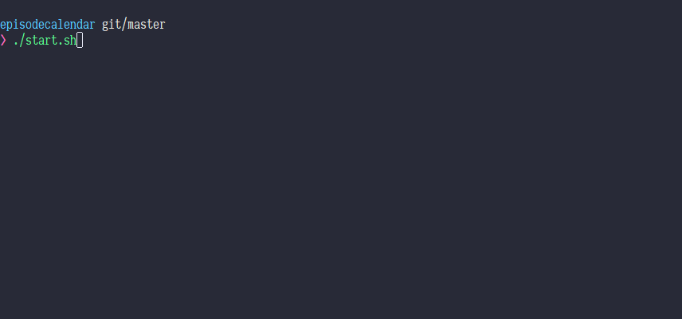

# episodecalendar-exporter

Requires Node.js 7.6 or later.



## Usage from docker

```
docker run --rm -e EPCAL_EMAIL="someadress@somehost.com" -e EPCAL_PASS="b2YgeW91ciBmdWNraW5nIGJ1c2luZXNz" -e DEBUG="epcal:*" -e EPCAL_OUT_DIR=/data asnapper/epcal:1.0.0
```
